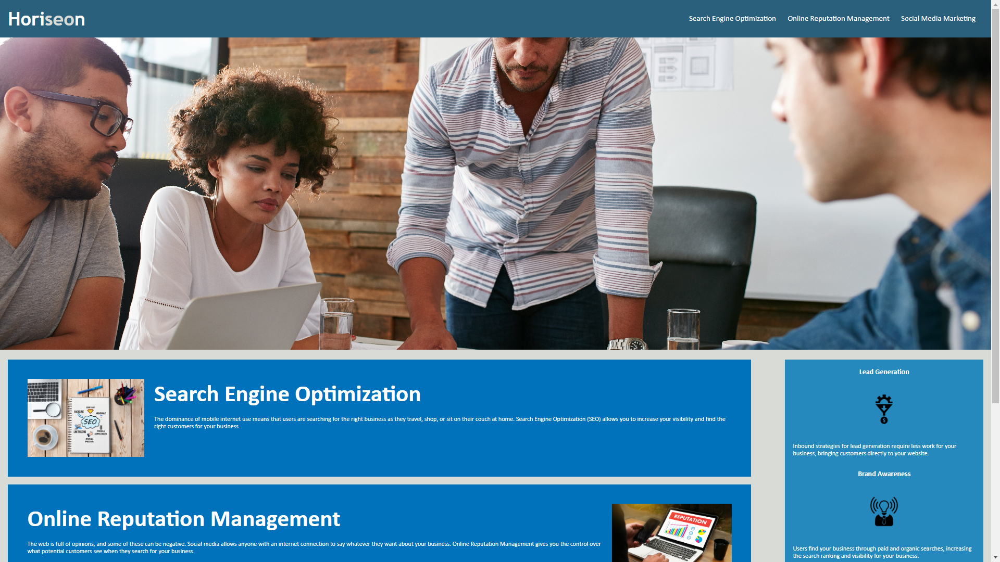

# horiseon-refractor-challenge
The goal of this project was to fix what was wrong with the code, and consolidate the code, making it look more presentable, and rewriting code duplicates, and to fix the broken link in the header.

The application is a website of a business.

Some challenges that I went through was figuring out how to consolidate the style.css.  I initially thought that i had to make a new class, and change the class being used in the html to the new class, but the website wouldn't look how it was supposed to look.  So then I thought, "shouldn't I be able to just use a comma and combine the classes".  Then I tried it and it worked.

[Horiseon](https://emmanueljatto.github.io/horiseon-refractor-challenge/)